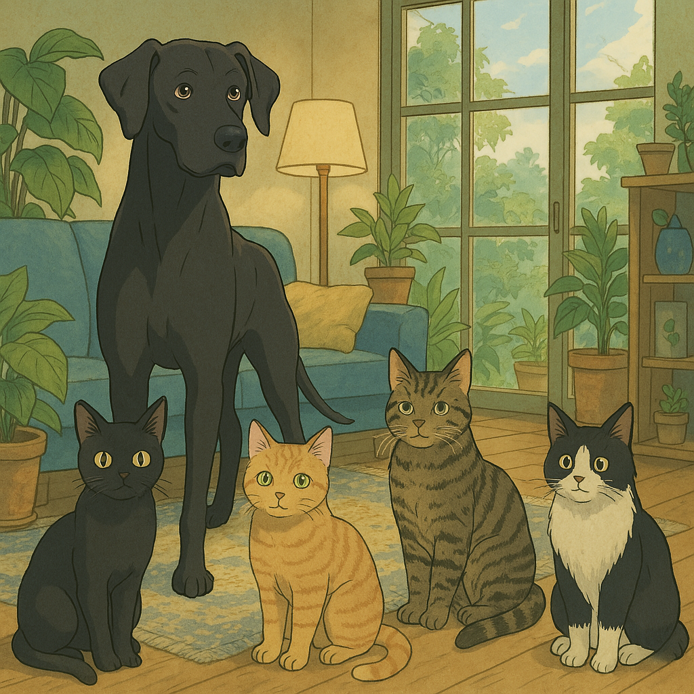

# Programación con objetos I
## Presentación Personal

### Datos Personales
- Mi nombre es: Leonela Chazarreta
- Vivo en Moron.

### Otra Información
- Soy estudiante de la Tecnicatura Universitaria en Programación y becaria del Programa de Fortalecimiento a las Trayectorias Académicas de la universidad. Además soy alumna asistente en la asignatura Matemática para Informática II y asistente voluntaria del Taller de e-Sports UNAHUR.
- Vivo con mi pareja y mis mascotas, mi perro: Zodd, y mis cuatro gatos: Salem, Gon, Yuna y Betum.
- Me gusta gestionar proyectos, colaborar en la universidad y vivir con estres. 
- Soy fan del manga y el anime, me gusta ver series de suspenso y mis pelis favoritas son las de terror/horror cósmica. Me gusta el metal en todas sus ramas e ir a recitales. 
- En mis tiempos libres me gusta dibujar, diseñar y decorar. 
- Y si, este es mi primer contacto con github.
